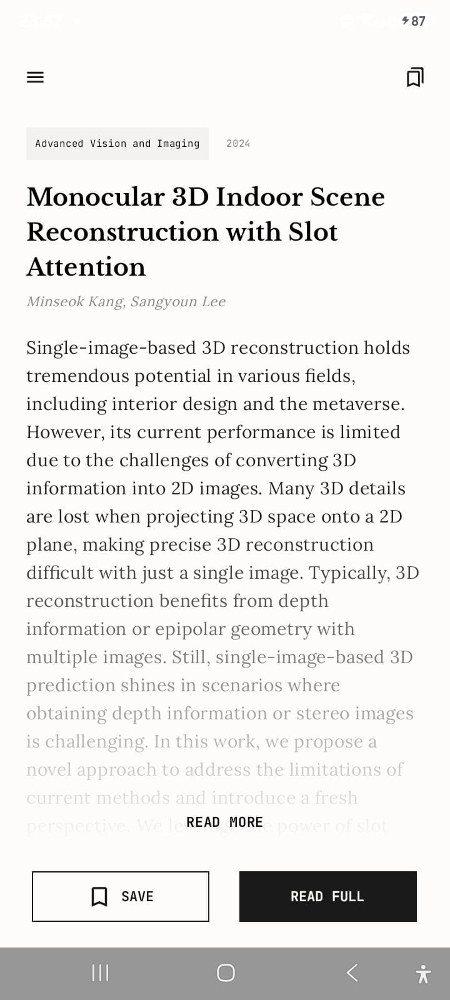
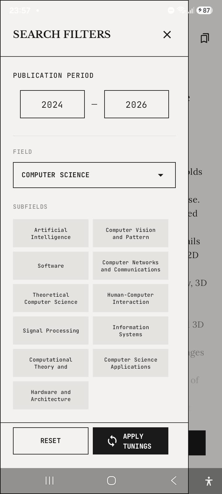

# PaperBites

PaperBites is a modern Android application designed for consuming bite-sized Research Paper.

<!--suppress HtmlDeprecatedAttribute -->

  
  

## Tech Stack

- **Language**: Kotlin
- **UI Framework**: Jetpack Compose
- **Architecture**: MVVM with Repository pattern
- **Local Storage**: Room Database
- **Network**: Retrofit with OpenAlex API
- **Paging**: Paging 3 for efficient list loading
- **Dependency Injection**: Manual injection (AppContainer pattern)
- **Asynchronous Work**: Kotlin Coroutines & Flow

## TODO

- [ ] Implement advances search for articles.
- [ ] Fix latex rendering issues
- [x] Implement Saved and Bookmark
- [ ] Implement Read Full Paper
- [ ] Add quick share link/doi for the paper
- [ ] Further refine dark mode and add custom color themes.
- [ ] Optimize layout
